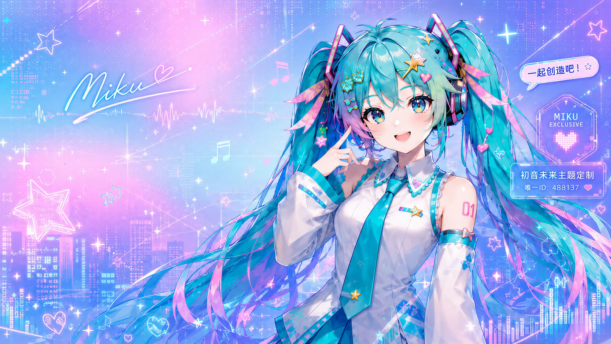

# ZCode Skin | ZCode 换肤工具

<div align="center">

**写代码的地方，也该是你喜欢的样子。**

一张图片就是一套主题。装好之后，换肤只是界面里的一次点击，随时一键还原官方外观。

*Reskin ZCode Desktop with one image. Native controls stay fully interactive.*

[](LICENSE)


[快速开始](#快速开始macos) · [做你自己的主题](#用一张图做你自己的主题) · [内置主题](#内置-22-套主题) · [使用须知](#使用须知都是实话) · [English](README.en.md)

</div>

> ## 🆕 1.2.0 更新：安全加固 + 测试套件
>
> 主题服务（9344）加上 Origin 校验——浏览器里网页的跨站请求一律 403，只有 ZCode 注入面板和本机进程放行；注入体积上限 16MB、上传收紧到 12MB；state.json 加并发写保护（文件锁 + 原子改名）；守护进程复用 CDP 长连接，日志超 1MB 自动轮转。新增 `node diag.mjs` 一站式体检和 111 个用例的零依赖测试套件（`npm test`）。完整变更见 [CHANGELOG.md](CHANGELOG.md)。

## 它长这样

下面是内置主题的主视觉图。注入后背景铺满整窗，侧栏、输入框、对话区全是 ZCode 原生控件，可以正常点。

| 鸣潮 · 声骸 | 原神 · 星夜 |
| --- | --- |
|  |  |

| 恋与深空 · 晨曦 | 大佬 · 点烟 |
| --- | --- |
|  |  |

| Miku 488137 | 龙珠 · 超级赛亚人 |
| --- | --- |
|  |  |

## 快速开始（macOS）

环境要求：macOS + Node.js 22 及以上（零 npm 依赖，CDP 通信用 Node 自带的 WebSocket 和 fetch）。ZCode 默认不带调试端口，换肤前先执行一次：

```bash
bash apply-skin.sh        # 退出 ZCode → 带端口(9343)重启 → 注入默认皮肤，会话数据不丢
bash install-daemon.sh    # 可选：ZCode 界面里的 🎨 主题中心 + 皮肤保活 + 恢复提醒
bash make-launcher.sh     # 可选：「ZCode 皮肤.app」到 ~/Applications，双击恢复上次皮肤
```

日常换肤**不重启 ZCode、立即生效**：

```bash
bash use-skin.sh          # 交互菜单：输入编号或名字切换
bash use-skin.sh 5        # 按编号切换
bash use-skin.sh 佐助      # 按名字切换（支持中文模糊匹配）
bash use-skin.sh 还原      # 移除皮肤，恢复官方外观
```

名字匹配规则：先按目录名匹配，再按显示名模糊匹配（忽略空格和中点，「原神·晨曦」「原神 晨曦」「原神晨曦」效果相同）；匹配到多套时列出候选并切第一套。

`apply-skin.sh` 的重启动作由 macOS launchd 以系统任务执行，独立于 ZCode 进程，内置保底：无论哪步失败，最后都会确保 ZCode 处于运行状态。也可以手动带端口启动（效果等同）：`open -a ZCode --args --remote-debugging-address=127.0.0.1 --remote-debugging-port=9343`。

> ⚠️ 工具目录不要放在「下载」「桌面」「文稿」这类受 macOS 隐私保护的文件夹：launchd 无法执行其中的脚本（报 `Operation not permitted`），`apply-skin.sh` 会失败。日常切换主题不受影响，只影响涉及 launchd 的首次启用。

## ZCode 界面里的「🎨 主题中心」

装好守护进程后，ZCode 界面右下角会出现一个半透明的 🎨 圆形按钮：

- **主题列表**：色卡预览 + 深浅图标 + 当前主题打勾，点一下立即换肤
- **＋ 自定义图片**（≤12MB）：选一张图，自动取色/判深浅/校正主色，当场生成新主题并换上
- **🎲 随机主题**：随机换一套，避开当前主题，不连续重复
- **🔁 常驻开关**（默认开）：关掉后本次会话皮肤继续用，ZCode 下次启动恢复官方外观
- **📖 阅读增强**（默认关）：AI 回复和思考过程块加 90% 主题自适应半透明底色，背景图主题下文字更易读
- **● 收起为小圆点**：把 🎨 按钮收成小圆点（Cmd+点击按钮也能切换），小圆点悬停放大、点击照常打开
- 底部「还原官方外观」一键去皮肤

ZCode 刷新或升级后按钮和面板消失的话，守护进程 5 秒内自动补回（「🔁 常驻」关闭时除外）。终端 `use-skin.sh` 和面板两边切换会互相同步（谁最后操作听谁的）。

## 皮肤守护进程与启动器

守护进程（LaunchAgent，`install-daemon.sh` 安装、`uninstall-daemon.sh` 卸载）做三件事：

1. **主题中心**：给 ZCode 界面注入 🎨 按钮和面板，提供面板用的主题列表/CSS/上传/随机/设置接口
2. **皮肤保活**：ZCode 刷新/升级导致皮肤丢失时，每 5 秒巡检一次自动补回（「常驻」关闭时停止注入）
3. **恢复提醒**：ZCode 被普通方式（启动台/访达）重启后调试端口消失，弹 macOS 系统通知提醒恢复。**守护进程自己绝不会重启 ZCode**

「ZCode 皮肤.app」启动器（`make-launcher.sh` 生成到 `~/Applications`）双击即可：ZCode 在跑但皮肤丢了 → 按上次主题自动恢复（不重启 ZCode）；端口丢了 → 弹窗指引恢复命令；顺带自检守护进程。电脑重启、ZCode 升级或皮肤意外丢失后，双击这个 App 就行。

卸载守护进程后，已注入的皮肤和按钮还在，但按钮的列表会加载失败（可用 `node apply.mjs --remove-panel` 把按钮移掉）。

## 用一张图做你自己的主题

三条路，从省事到好玩：

1. **面板直接传**：主题中心里「＋ 自定义图片」，上传成功自动生成并换上（与命令行同一套取色逻辑）
2. **命令行生成**：`node create-theme.mjs --image /path/to/图片.jpg --name "主题名"`，PNG/JPG/WebP 都行，支持 `--id` / `--appearance dark|light`（默认按图片亮度自动判定）/ `--force` 覆盖同名
3. **让 AI 全包**：把 `skill/zcode-skin/SKILL.md` 交给 ZCode/Agent，直接说「换一套赛博朋克主题」

自动完成：图片取色（统计色相得主色辅色、算亮度）→ 深浅判定 → 主色过暗/过亮时保色相校正到可读区间 → 图片设为整窗背景。缺背景图的话，[主题提示词库](docs/theme-prompts.md) 有 8 套风格现成的生图提示词。

也能手工编写：`themes/` 下新建目录，放一个 `theme.json`：

```json
{
  "id": "my-theme",
  "name": "我的主题",
  "appearance": "dark",
  "heroImage": "hero.webp",
  "colors": {
    "sidebar": "#0a1526f0",
    "card": "#12233ae6",
    "foreground": "#dbe7ff",
    "brand": "#38bdf8"
  }
}
```

- `heroImage` 是背景图文件名（背景铺满整窗）；不想要图片用 `heroCss` 写任意 CSS 背景（渐变等），两个都不写就是纯配色主题
- `colors` 全部可选，支持 39 个键（对应 ZCode 界面全部颜色变量，清单见 `lib/theme.mjs` 的 `VAR_MAP`），格式 `#RRGGBB` 或 `#RRGGBBAA`（末两位透明度）
- 新主题立即出现在菜单和面板里，无需重启任何东西；生成前可 `node apply.mjs --dry-run --theme themes/my-theme` 预览 CSS

## 内置 22 套主题

高精度背景图主题（鸣潮、原神、火影、恋与深空、龙珠、Miku 等 14 套）+ 8 套渐变主题，编号与 `use-skin.sh` 菜单序号一致：

| # | 目录名 | 名称 | 深浅 | 类型 |
|---|---|---|---|---|
| 1 | cyber-neon | 赛博霓虹 | 🌙 | 渐变 |
| 2 | dalao-dianyan | 大佬 · 点烟 | 🌙 | 背景图 |
| 3 | deepspace-dawn | 恋与深空 · 晨曦 | ☀️ | 背景图 |
| 4 | deepspace-star | 恋与深空 · 星辰 | 🌙 | 背景图 |
| 5 | default | 极光蓝 · 玻璃 | 🌙 | 渐变 |
| 6 | dragonball-nimbus | 龙珠 · 筋斗云 | ☀️ | 背景图 |
| 7 | dragonball-super-saiyan | 龙珠 · 超级赛亚人 | ☀️ | 背景图 |
| 8 | forest-rain | 雨林墨绿 | 🌙 | 渐变 |
| 9 | genshin-dawn | 原神 · 晨曦 | ☀️ | 背景图 |
| 10 | genshin-night | 原神 · 星夜 | 🌙 | 背景图 |
| 11 | grape-soda | 葡萄气泡 | 🌙 | 渐变 |
| 12 | miku-488137 | Miku 488137 | ☀️ | 背景图 |
| 13 | mint-dawn | 薄荷晨雾 | ☀️ | 渐变 |
| 14 | mysterious-revival | 神秘复苏 | 🌙 | 背景图 |
| 15 | naruto-hokage | 火影 · 鸣人 | 🌙 | 背景图 |
| 16 | naruto-sasuke | 火影 · 佐助 | 🌙 | 背景图 |
| 17 | origami | 折纸 | 🌙 | 背景图 |
| 18 | paper-cream | 宣纸米白 | ☀️ | 渐变 |
| 19 | sakura-mist | 樱雾粉青 | 🌙 | 渐变 |
| 20 | sunset-gold | 落日熔金 | 🌙 | 渐变 |
| 21 | wuthering-echo | 鸣潮 · 共鸣 | 🌙 | 背景图 |
| 22 | wuthering-tide | 鸣潮 · 声骸 | 🌙 | 背景图 |

动漫背景图版权归各自权利人，仅供个人使用。

## 命令速查

| 命令 | 作用 |
|---|---|
| `bash use-skin.sh` | 交互菜单：选编号或名字切换主题 |
| `bash use-skin.sh <编号/名字/还原>` | 直接切换 / 还原 |
| `bash install-daemon.sh` | 安装守护进程：🎨 主题中心 + 皮肤自动恢复 + 恢复提醒 |
| `bash uninstall-daemon.sh` | 卸载守护进程 |
| `bash make-launcher.sh` | 生成「ZCode 皮肤.app」启动器到 ~/Applications |
| `bash apply-skin.sh` | 首次启用：带调试端口重启 ZCode 并注入（ZCode 被普通重启后也用它恢复） |
| `node apply.mjs --list` | 列出全部主题 |
| `node apply.mjs --status` | 查询当前皮肤状态（是否生效、主题 ID、关键变量值、主题中心是否在位） |
| `node apply.mjs --theme themes/<名字>` | 注入指定主题（默认 default） |
| `node apply.mjs --panel` | 注入皮肤的同时注入主题中心按钮 |
| `node apply.mjs --remove-panel` | 只移除主题中心按钮（不动皮肤） |
| `node apply.mjs --dry-run --theme <目录>` | 只生成 CSS 不注入 |
| `node apply.mjs --port <端口>` / `--wait <毫秒>` | 指定 CDP 端口（默认 9343）/ 等主窗口时长（默认 15000） |
| `node create-theme.mjs --image <图> --name <名>` | 图片生成新主题 |
| `node restore.mjs` | 还原官方外观（效果同 `use-skin.sh 还原`） |
| `node diag.mjs` | 一站式体检：守护进程/端口/主窗口/注入状态/state.json |
| `npm test` | 跑测试套件（`node --test`，111 个用例，零依赖） |

## 文件结构

```
zcode-skin/
├── use-skin.sh               # 日常入口（菜单实现在 lib/menu.mjs）
├── apply-skin.sh             # 首次启用入口（launchd 一次性重启+注入）
├── install-daemon.sh         # 安装皮肤守护进程（LaunchAgent）
├── uninstall-daemon.sh       # 卸载守护进程
├── daemon.mjs                # 守护进程：主题中心数据服务 + 皮肤保活 + 恢复提醒
├── apply.mjs                 # 注入器
├── create-theme.mjs          # 图片自动生成主题
├── restore.mjs               # 还原
├── diag.mjs                  # 一站式体检（守护进程/端口/主窗口/注入状态/state.json）
├── relaunch-via-launchd.sh   # apply-skin.sh 调用的重启器（无需直接使用）
├── launch.sh                 # 旧版启动器（已被 apply-skin.sh 取代，保留备用）
├── make-launcher.sh          # 生成「ZCode 皮肤.app」启动器
├── package.json              # npm test 入口（零依赖，要求 Node 22+）
├── state.json                # 当前主题与设置（终端/面板共用，已 gitignore）
├── lib/
│   ├── cdp.mjs               # CDP 客户端（零依赖，含主窗口识别）
│   ├── theme.mjs             # theme.json 校验 + 注入 CSS 生成（VAR_MAP 在这）
│   ├── palette.mjs           # 4 色→界面变量映射 + 主色可见度校正
│   ├── autocolor.mjs         # 图片取色→主题生成（终端与面板上传共用）
│   ├── inject.mjs            # 所有注入脚本片段（皮肤/面板/阅读增强/状态检查）
│   ├── panel.js              # 主题中心界面（注入 ZCode 内运行）
│   ├── state.mjs             # state.json 读写（主题 + 设置开关）
│   └── menu.mjs              # use-skin.sh 交互菜单
├── test/                     # 测试套件（7 个文件，111 个用例，node --test）
├── skill/zcode-skin/         # AI Skill（可交给 ZCode/Agent 直接操作本工具）
├── docs/theme-prompts.md     # 主题背景图生成提示词库（8 套风格）
├── themes/                   # 22 套主题，一目录一套
└── logs/                     # 运行日志（已 gitignore）
```

## 使用须知（都是实话）

- 注入走本机回环 CDP（`127.0.0.1:9343`），只覆盖 CSS 变量，**不修改 ZCode 应用本体**（不动安装目录、不改签名、不碰会话数据）；未来 ZCode 改启动参数、界面结构或颜色变量名时，本项目仍可能需要适配
- 皮肤是运行时注入：装了守护进程时，ZCode 刷新/升级后皮肤和主题中心自动补回；ZCode 被普通方式重启（端口消失）则皮肤随窗口消失，收到系统通知后重新执行一次 `apply-skin.sh` 恢复
- 两个本地端口都只绑定 127.0.0.1 本机回环、不对外网开放，但都**没有身份认证**：9343 是 ZCode 的调试端口，9344 是守护进程的主题数据服务（已做 Origin 校验，浏览器里网页的跨站请求 403），同机同权限进程仍在威胁边界内。完整说明见 [SECURITY.md](SECURITY.md)
- ZCode 版本更新后若界面颜色变量改名，皮肤可能部分失效：`node apply.mjs --status` 可查看注入是否还在生效
- 出问题先跑 `node diag.mjs`：守护进程健康、调试端口、主窗口可达性、注入状态、state.json、主题目录逐项检查，每项带修复指引

## English

**ZCode Skin** reskins ZCode Desktop through loopback CDP injection (`127.0.0.1:9343`) without modifying the app bundle, code signature, or session data — only CSS variables are overridden. One image becomes one theme; the in-app 🎨 theme center switches instantly; one click restores the official UI. Full English documentation: [README.en.md](README.en.md).

## 许可证与素材

代码使用 [MIT License](LICENSE)。该许可只覆盖软件代码，不授权角色、商标或第三方视觉素材——内置动漫背景图版权归各自权利人，仅供个人使用。安全边界见 [SECURITY.md](SECURITY.md)，更新历史见 [CHANGELOG.md](CHANGELOG.md)。

---

**觉得不错就点个 Star。换好了皮肤，记得常回来换新的。**
